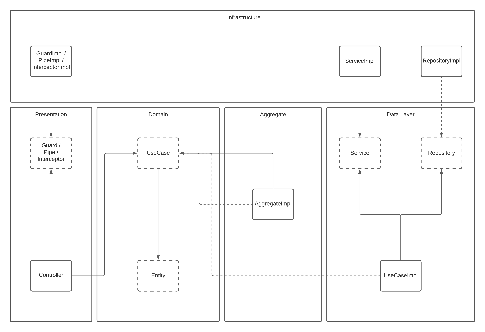

# Arquitetura do projeto

Abaixo é possível visualizar a arquitetura básica do projeto.

O modelo está simplificado e não apresenta todos os componentes existentes no projeto, mas pode-se observar alguns detalhes interessantes:
- o ___domínio___ do projeto é completamente ___independente___
- o vetor de dependências aponta em direção ao domínio
- há um alto grau de ___desacoplamento___
- uma implementação sempre "conversa" com uma abstração

A ideia é que ao manter esses princípios básicos, garantimos que o projeto evolua de maneira consistente, mantenha-se escalável e manutenível.